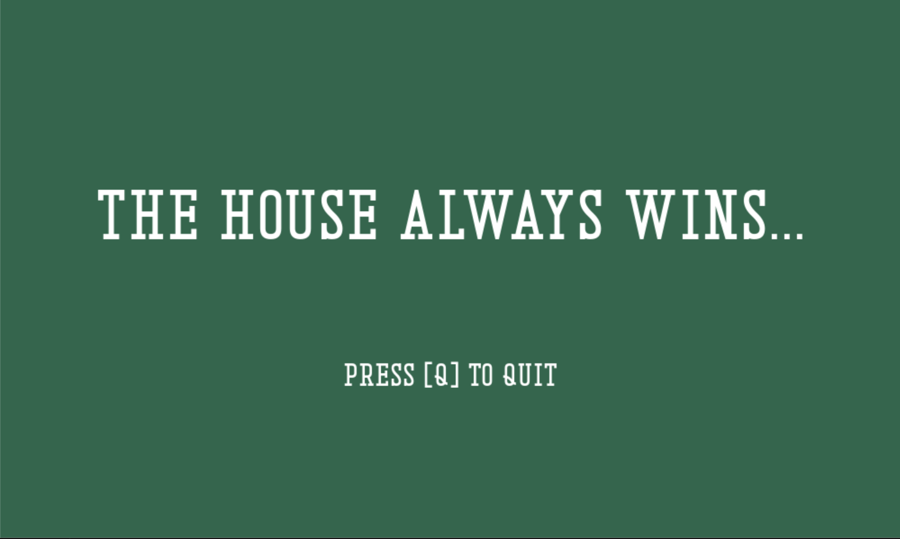

# gracestalker_ew200_AY2025_pygame
### this is a project for my ew200 class
### this is a game of blackjack

## Here are some photos of my game!
### title screen

### betting screen
 
### gameplay

### end screens

## **Game Instructions**:
 - When you start the file, the welcome and instruction screens will appear.
 - When the title screen appears, click 'Start' to begin playing the game or press the 'X' button in the corner to quit the program.
 - Make your bet on the betting screen, but ensure that your bet does not exceed your total!
 - After you are dealt your cards, you have a couple options:
   - You can either:
     - Press [H] on your keyboard to Hit and gain another card
     - Press [S] on your keyboard to Stand and let the dealer draw
     - Press [F] on your keyboard to Split on the same value card to have two hands
     - Press [D] on your keyboard to Double Down. You will get one card and your Total Bet will double.
 - After the round is over, you have a couple options:
   - You can either:
     - Press [R] on your keyboard to Play Again
     - Press [Q] on your keyboard to Quit the Game
 - Your total will either increase or decrease based on how much you win or lose.
 - Once you reach 0, your game will be over!
 - Enjoy!

